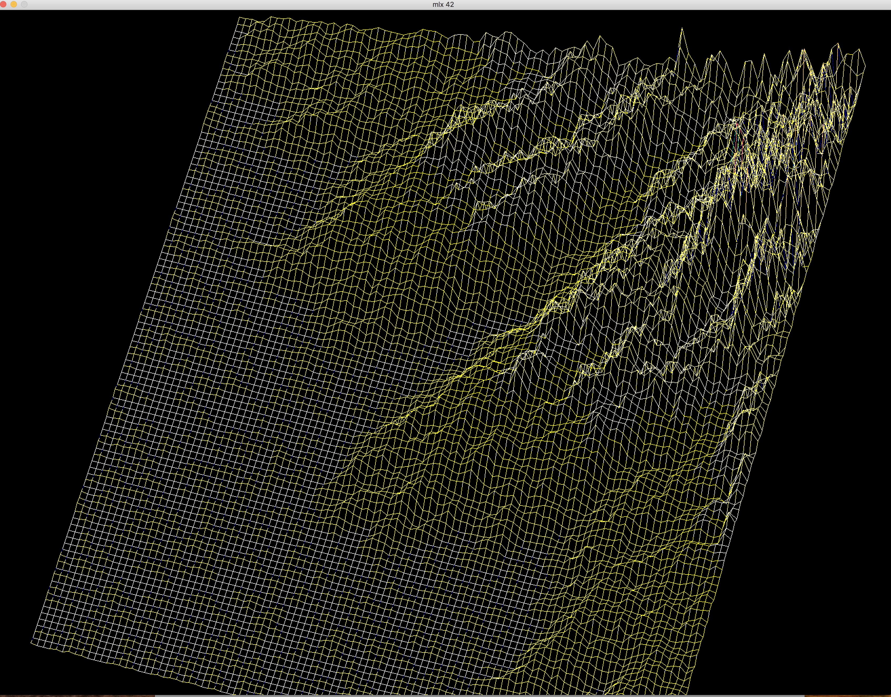
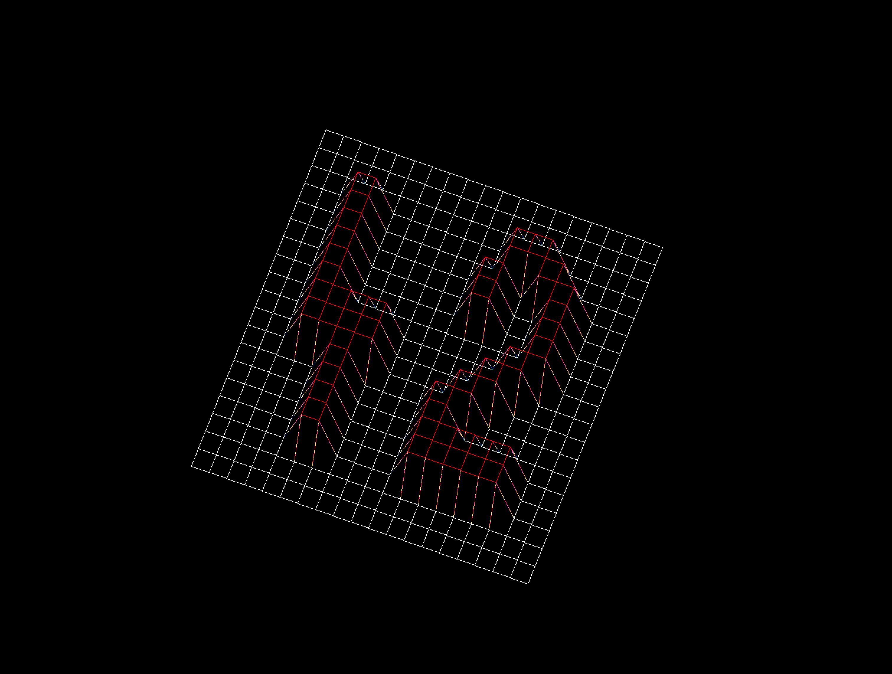
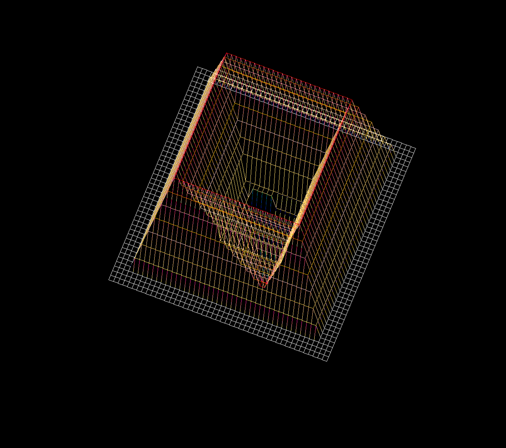
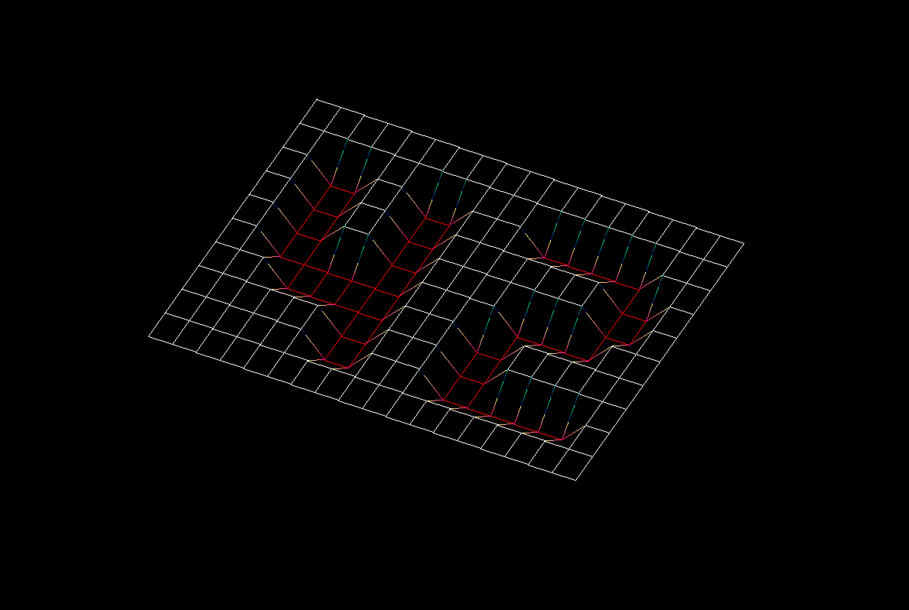

# FdF @ 42

A simple 3D height-map renderer. You can rotate models, color is defined by
relative height in the map. More features planned!

## Features
* Zoom-in Zoom-out (with 0 and 1 in key pad)
* change in upper bounds (with plus and minus in key pad)
* move left right up down (with arrow keys)

## Compiling and running
Write `make re`.

Run it with `./fdf [map]`. sample maps are provided in `test_maps`
directory.

